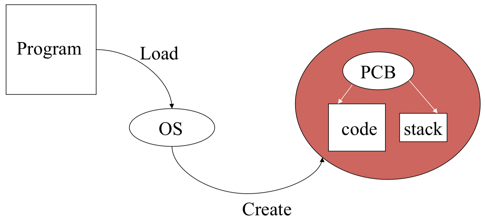

Title:  Markdown Extended Syntax  
Author: Leon F. Guerrero  
Date:   February 10, 2020  

[[_TOC_]]

<br>

<!--
|@@@@@@@@@@@@@@@@@@@@@@@@@@@@@@@@@@@@@@@@@@@@@@@@@@@@@@@@@@@@@@@@@@@@@@@@@@@@@|
|@@@@@@@@@@@@@@@@@@@@@@@@@@@@@@@@@@@@ [1] @@@@@@@@@@@@@@@@@@@@@@@@@@@@@@@@@@@@|
|@@@@@@@@@@@@@@@@@@@@@@@@@@@@@@@@@@@@@@@@@@@@@@@@@@@@@@@@@@@@@@@@@@@@@@@@@@@@@|
-->
# 1. References

- [Basic Syntax | Markdown Guide](https://www.markdownguide.org/basic-syntax)
- [MultiMarkdown Syntax Guide · fletcher | GitHub](https://github.com/fletcher/MultiMarkdown/wiki/MultiMarkdown-Syntax-Guide)
- [Markdown Cheatsheet · adam-p | GitHub](https://github.com/adam-p/markdown-here/wiki/Markdown-Cheatsheet)
- [Pandoc's Markdown - Pandoc User’s Guide](https://pandoc.org/MANUAL.html#pandocs-markdown)
- [Atom *language-pfm* Package | GitHub](https://github.com/leipert/language-pfm/blob/dist/docs/supported-features.md)
- [Markdown Guide - Extended Syntax](https://www.markdownguide.org/extended-syntax/)
- [Writing Markdown in Editorial](http://omz-software.com/editorial/docs/ios/editorial_writing_markdown.html)
- [KaTeX Supported Functions](https://katex.org/docs/supported.html)
- [KaTeX Support Table](https://katex.org/docs/support_table.html)
- [CriticMarkup](http://criticmarkup.com/users-guide.php)

<br>

<!--
|@@@@@@@@@@@@@@@@@@@@@@@@@@@@@@@@@@@@@@@@@@@@@@@@@@@@@@@@@@@@@@@@@@@@@@@@@@@@@|
|@@@@@@@@@@@@@@@@@@@@@@@@@@@@@@@@@@@@ [1] @@@@@@@@@@@@@@@@@@@@@@@@@@@@@@@@@@@@|
|@@@@@@@@@@@@@@@@@@@@@@@@@@@@@@@@@@@@@@@@@@@@@@@@@@@@@@@@@@@@@@@@@@@@@@@@@@@@@|
-->
# 2. Extended Markdown

The [basic syntax](https://www.markdownguide.org/basic-syntax) outlined in John Gruber’s original design document has been extended by adding additional syntax elements. 

**Extended syntax elements** can be enabled by using a *lightweight markup language* that builds upon the basic Markdown syntax, or by adding *extensions* to a compatible Markdown processor.

<br>

## 2.1. Lightweight Markup Languages

There are several lightweight markup languages that are supersets of Markdown. Many of the most popular Markdown applications use one of the following languages:

* [GitHub Flavored Markdown (GFM)](https://github.github.com/gfm/)
* [Markdown Extra](https://michelf.ca/projects/php-markdown/extra/)
* [MultiMarkdown](https://fletcherpenney.net/multimarkdown/)
* [CommonMark](https://commonmark.org/)
* [R Markdown](https://rmarkdown.rstudio.com/)

<br>

## 2.2. VS Code Extensions

VS Code supports Markdown files out of the box. In addition to VS Code's basic Markdown editing, VS Code offers a number of Markdown extensions for greater functionality.

Some of the most recommended Markdown extensions from the [Visual Studio Marketplace](https://marketplace.visualstudio.com/) are:

- [Markdown All in One](https://marketplace.visualstudio.com/items?itemName=yzhang.markdown-all-in-one)
- [Markdown AutoTOC](https://marketplace.visualstudio.com/items?itemName=wibblemonkey.markdown-auto-toc)
- [Markdown Extended](https://marketplace.visualstudio.com/items?itemName=jebbs.markdown-extended)
- [Markdown Header Coloring](https://marketplace.visualstudio.com/items?itemName=satokaz.vscode-markdown-header-coloring)
- [Markdown PDF](https://marketplace.visualstudio.com/items?itemName=yzane.markdown-pdf)
- [Markdown Preview Enhanced](https://marketplace.visualstudio.com/items?itemName=shd101wyy.markdown-preview-enhanced)
- [Markdown Shortcuts](https://marketplace.visualstudio.com/items?itemName=mdickin.markdown-shortcuts)
- [Markdown Table Prettifier](https://marketplace.visualstudio.com/items?itemName=darkriszty.markdown-table-prettify)
- [Markdown TOC](https://marketplace.visualstudio.com/items?itemName=AlanWalk.markdown-toc)
- [Markdown+Math](https://marketplace.visualstudio.com/items?itemName=goessner.mdmath)

<br>

<!--
|@@@@@@@@@@@@@@@@@@@@@@@@@@@@@@@@@@@@@@@@@@@@@@@@@@@@@@@@@@@@@@@@@@@@@@@@@@@@@|
|@@@@@@@@@@@@@@@@@@@@@@@@@@@@@@@@@@@@ [1] @@@@@@@@@@@@@@@@@@@@@@@@@@@@@@@@@@@@|
|@@@@@@@@@@@@@@@@@@@@@@@@@@@@@@@@@@@@@@@@@@@@@@@@@@@@@@@@@@@@@@@@@@@@@@@@@@@@@|
-->
# 3. Metadata

[MultiMarkdown][MM] has support for **metadata**, which is information about a document that is not necessarily part of the document contents.

To use metadata, add lines of **key:value** pairs to the top of the Markdown file. Each line of metadata should be followed by 2 spaces. This way, when the document is passed through a regular version of Markdown, the metadata will be properly formatted as plain text with line breaks, rather than joined into a single run-on paragraph.

**🅴**

The following example shows some of the available options for metadata.

```txt
Title:       Document Title  
Subtitle: 	 Document Subtitle
Author:      Author's Name  
Affiliation: Organization Name  
Web:         Author's web URL
Date:        February 10, 2020  
Keywords:    Comma-separated list of 
             keywords.
```

[MM]: https://github.com/fletcher/MultiMarkdown/wiki/MultiMarkdown-Syntax-Guide

<br>

<!--
|@@@@@@@@@@@@@@@@@@@@@@@@@@@@@@@@@@@@@@@@@@@@@@@@@@@@@@@@@@@@@@@@@@@@@@@@@@@@@|
|@@@@@@@@@@@@@@@@@@@@@@@@@@@@@@@@@@@@ [1] @@@@@@@@@@@@@@@@@@@@@@@@@@@@@@@@@@@@|
|@@@@@@@@@@@@@@@@@@@@@@@@@@@@@@@@@@@@@@@@@@@@@@@@@@@@@@@@@@@@@@@@@@@@@@@@@@@@@|
-->
# 4. Text

<br>

## 4.1. Emphasis

**Emphasize text** using 1, 2, or 3 asterisks (`*`) or underscores (`_`), as follows:

```md
*italic*
**bold**
***bold and italic***
```

**🅴**

- This is *italic*.
- This is **bold**.
- This is ***bold and italic***.

<br>

## 4.2. Verbatim

Type verbatim text inline by surrounding it with 1 backtick character (`` ` ``) on each side, as follows:

```md
`verbatim text`
```

Any text indented 4 of more spaces becomes verbatim text.

```md
||||
    verbatim text
```

Any text surrounded by 3 backticks (```` ``` ````) or tildes (`~~~`) creates a  **verbatim text environment**.

````
```
verbatim text
environment
```
````

The following examples show how verbatim text is rendered.

**🅴**

This is a normal paragraph with `some inline verbatim text`.

**🅴**

    indented text > verbatim


**🅴**

```
verbatim text
environment
```

<br>

## 4.3. Strike-through

**Strike out text** by surrounding it with 2 tilde characters (`~~`) on each side or enclosing it using HTML `<\s>` or `<\del>` tags, as follows:

```md
     ~~Scratch this~~
  <s>~~Scratch this~~</s>
<del>~~Scratch this~~</del>
```

**🅴**

- ~~Scratch this.~~ (Markdown)
- <s>~~Scratch this.~~</s> (HTML)
- <del>~~Scratch this.~~</del> (HTML)

<br>

## 4.4. Superscript and Subscript

**Superscript text** by surrounding it with 1 tilde character (`~`) on each side and **subscript text** by surrounding it with 1 caret character (`^`) on each side, as follows:

```md
2^10^   # superscript '10'
H~2~O   # subscript '2'
```

**🅴**

- 2^10^ = 1024
- x^a^ • x^b^ = x^a+b^
- H~2~O
- Speedup~overall_system~

<br>
  
## 4.5. Symbols

Markdown supports a great number of [symbols, special characters, fancy text, and Emoji](https://coolsymbol.com/) directly.

**🅴**

░ █ ✔ | - | – | — | ® | § | ¬ | • | ∘ | · | ° | º | ² | » ♫ 🙂

<br>

## 4.6. CriticMarkup

[CriticMarkup](http://criticmarkup.com/users-guide.php) offers authors and editors a way to track changes to documents in plain text by highlighting text insertions, deletions, and substitutions using combinations of distinctive characters. The syntax is supported only by some flavors of Markdown.

There are five types of **Critic marks**:

| Type         | Example                                           |
| ------------ | ------------------------------------------------- |
| Addition     | {++ add new text ++}                              |
| Deletion     | {-- delete this text --}                          |
| Substitution | {~~ old text ~> new text ~~}                      |
| Comment      | {>> This is a comment. <<}                        |
| Highlight    | {== highlighted text ==}{>> [related comment] <<} |

Critic marks can be represented as follows for use in paragraphs.

- {++ A ++}
- {-- D --}
- {~~ X ~> Y ~~}
- {>> C <<}
- {== H ==}{>> [HC] <<}

<br>

## 4.7. Links

There are three types of **links** in Markdown: **raw**, **inline**, and **reference** links.

- **Raw links** contain the URL only.  

	```md
	http://google.com
	```

- **Inline links** contain the URL in parentheses, directly after the title/identifier enclosed in brackets.   

	```md
	[Google Search](http://google.com)
	```

- **Reference links** use a second set of square brackets to enclose an arbitrary identifier instead of a URL.  

	```md
	[Google Search][1]
	[Google Search][G]
	```

	The ***reference link identifiers*** can be defined anywhere else in the document and they are omitted in the Markdown preview.  

	```md
	[1]: http://google.com
	[G]: http://google.com
	```

**🅴**

- http://google.com
- [Google Search](http://google.com) (*inline*)
- [Google Search][1] (*reference, with identifier* "1")
- [Google Search][G] (*reference, with identifier* "G")

[1]: http://google.com
[G]: http://google.com

<br>

## 4.8. Footnotes

**Footnotes** use square brackets to enclose a caret followed by an arbitrary note identifier, as follows:   

```md
text[^1]   # Number identifier
text[^N]   # Name identifier
```

The ***note identifier*** is usually defined at the bottom of the section and includes the desired *footnote text*. The footnote is displayed at the end of the document.

```md
[^1]: Numbered footnote text.
[^N]: Named footnote text.
```

**🅴**

- This is a *numbered* footnote[^1].
- This is a *named* footnote[^Name].

[^1]: Numbered footnote text.
[^Name]: Named footnote text.

<br>

<!--
|@@@@@@@@@@@@@@@@@@@@@@@@@@@@@@@@@@@@@@@@@@@@@@@@@@@@@@@@@@@@@@@@@@@@@@@@@@@@@|
|@@@@@@@@@@@@@@@@@@@@@@@@@@@@@@@@@@@@ [1] @@@@@@@@@@@@@@@@@@@@@@@@@@@@@@@@@@@@|
|@@@@@@@@@@@@@@@@@@@@@@@@@@@@@@@@@@@@@@@@@@@@@@@@@@@@@@@@@@@@@@@@@@@@@@@@@@@@@|
-->
# 5. Blocks

<br>

## 5.1. Paragraphs

**Paragraphs** are separated by blank lines. A single line break does not results in a new paragraph.

<br>

## 5.2. Rules

**Rules** can be used to separate paragraphs or sections of documents with a horizontal line. Use `***` or `---` in a separate line to create a rule.

<br>

## 5.3. Lists

There are two main types of **lists** in Markdown: **ordered** and **unordered** lists. Lists can also be **single-level** or **multi-level** (*nested*). If one or more items in a list are indented, we have a **nested list**.

**Ordered lists** use line items with numbers followed by periods. The numbers don’t have to be in numerical order, but the list should start with `1`.

**🅴**

1. Line 1
2. Line 2
3. Line 3
	1. Sub 3.1
	2. Sub 3.2

**Unordered lists** use asterisks, plus symbols, or hyphens as list markers.

**🅴**

* Item 1
	* Item 1a
	* Item 1b
+ Item 2
- Item 3

List markers can be combined to obtain a mixture of ordered and unordered lists, which can also be nested. Every sublevel must be indented by a 2-space tab (`	`). This requirement makes VS Code and other applications, such as  1Writer for iOS, display this type of list correctly.

1. Level 1
2. Level 2
	- Subitem a
	- Subitem b
		1. Sublevel 2b.1
		1. Sublevel 2b.2
3. Level 3
	1. Sublevel 3.1
	2. Sublevel 3.2
		- Subitem 3.2a
		- Subitem 3.2b
4. Level 4

<br>

## 5.4. Blockquotes

**Blockquotes** are indicated by a leading `'>'` character. They can contain multiple paragraphs, can be nested, and can contain other Markdown formatted elements. They have the following syntax:

```md
> This is a blockquote. This
paragraph has two lines (lazy form).
>
> New paragraph.
>
> > Nested paragraph.
> > > ...
```

```md
> Another blockquote with 
some Markdown formatted elements.
>
> - Item 1
> - Item 2
>
>  `verbatimn text`.
```

Blockquotes are rendered as follows:

**🅴**

> This is a blockquote. This
paragraph has two lines (lazy form).
>
> New paragraph.
>
> > Nested paragraph.
> > > ...

**🅴**

> Another blockquote with some Markdown formatted elements.
>
> - Item 1
> - Item 2
>
>  `verbatim text`

<br>

## 5.5. Code Blocks

**Code blocks** are verbatim text environments with syntax highlighting for many [supported Languages](https://gitpitch.com/docs/code-features/fenced-blocks/#code-language-hints-quick-reference-table). The language, usually in the form of an abbreviation, must be specified to the right of the first set of backticks, as follows:

````md
```py
def even(x):
    return x % 2 == 0
```
````

**🅴**

```py
def even(x):
	return x % 2 == 0
```

<br>

## 5.6. Adding Elements in Lists

Lists can contain blocks and other elements, which must be indented some number of spaces to preserve the continuity of the list. The number of spaces depends upon the type of element that is inserted.

**Paragraphs:**

**🅴**

- First list item.
- Second list item, then a paragraph.

    A paragraph below the second list item.

- Third list item.

<br>

**Blockquotes:**

**🅴**

- First list item.
- Second list item, then a blockquote.

    > A blockquote below the second list item.

- Third list item.

<br>

**Code blocks:**

**🅴**

Code blocks are normally indented 4 spaces. When they’re in a list, indent them 8 spaces.

1.  Some text.
2.  More text, then a code block.

	```html
	<html>
	  <head>
	    <title>Test</title>
	  </head>
	```

3.  Another line.

<br>

**Images:**

**🅴**

1.  Some text.
2.  More text, then an image.

    

3.  Close the file.

<br>

Different elements can be inserted into the same list, while preserving its continuity.

**🅴**

1. **First item** (no block)

1. **Second item**.

        verbatim text
        new line

    Continued.

3. **Third item** (with fenced code block)

    ```py
    def even(x):
      return x % 2 == 0
    ```

4. **Fourth item** (with blockquote)

    > Blockquote.
    > New line.

<br>

## 5.7. Ending Lists

**🅴**

Here, the java code block is treated as a block of item two and not as a block for the entire list.

- item one
- item two

    ```java
    System.out.println("Code");
    ```

To end or "cut off" the list after item two, insert some non-indented content, like an HTML comment, which will not produce visible output in any format.

- item one
- item two

<!-- end of list -->

```r
a <- 5
```

<br>

## 5.8. Definition Lists

Some Markdown processors, such as Pandoc's Markdown, support **definition lists**. These are lists of terms followed by their corresponding definitions.

A term may have multiple definitions, and each definition may consist of one or more block elements (paragraph, code block, list, etc.), each indented a number of spaces according to the type. Combinations of these are also allowed.

The following examples illustrate the syntax:

**🅴**

```md
**Term:**
: First definition of the term.
: Second definition of the term.
```

**🅴**

```md
**Definition:**

: **Term.**
	Description 1.

	$$ equation $$

  		Verbatim text.

	Description 2.

	```py
	code block
	```
```

The following examples show how these lists are rendered:

**🅴**

**Apple**
:	- Pomaceous fruit of plants of the genus Malus in the family Rosaceae.
:	- An american computer company.

**🅴**

**Definition:**

: **Term.**  
	Description.

	$$ x + y $$

**🅴**

**Definition:**

: **Term.**  
	Description 1.

  		Verbatim text.

 	 Description 2.

**🅴**

**Definition:**

: Description
	with lazy continuation.

	```java
	System.out.println("Java code");
	```

<br>

<!--
|@@@@@@@@@@@@@@@@@@@@@@@@@@@@@@@@@@@@@@@@@@@@@@@@@@@@@@@@@@@@@@@@@@@@@@@@@@@@@|
|@@@@@@@@@@@@@@@@@@@@@@@@@@@@@@@@@@@@ [1] @@@@@@@@@@@@@@@@@@@@@@@@@@@@@@@@@@@@|
|@@@@@@@@@@@@@@@@@@@@@@@@@@@@@@@@@@@@@@@@@@@@@@@@@@@@@@@@@@@@@@@@@@@@@@@@@@@@@|
-->
# 6. Tables

**Tables** are created using pipes (`|`), dashes (`-`), and semicolons (`:`) following some requirements, including:

- Columns are separated by pipe (`|`) characters.
- The colons (`:`) below the table headers indicate the column's alignment.
- The pipes at the beginning and end of lines are optional.
- There must be at least one `|` per line.
- Cells can be empty.

<!-- end of list -->

The following examples illustrate the syntax for tables.

**🅴**

[**Table caption**]
| Default | Left | Center | Right |
| ------- | :--- | :----: | ----: |
| 12      | 12   |   12   |    12 |
| 123     | 123  |  123   |   123 |
| 1       | 1    |        |     1 |

**🅴**

|              |          Grouping           ||
| First Header | Second Header | Third Header |
| ------------ | :-----------: | -----------: |
| Content      |         *Long Cell*         ||
| Content      |   **Cell**    |         Cell |

| New section  |    `More`     |         Data |
| And more     |          And more           ||
[**Prototype Table**]

<br>

<!--
|@@@@@@@@@@@@@@@@@@@@@@@@@@@@@@@@@@@@@@@@@@@@@@@@@@@@@@@@@@@@@@@@@@@@@@@@@@@@@|
|@@@@@@@@@@@@@@@@@@@@@@@@@@@@@@@@@@@@ [1] @@@@@@@@@@@@@@@@@@@@@@@@@@@@@@@@@@@@|
|@@@@@@@@@@@@@@@@@@@@@@@@@@@@@@@@@@@@@@@@@@@@@@@@@@@@@@@@@@@@@@@@@@@@@@@@@@@@@|
-->
# 7. Media

## 7.1. Local Images 

**Markdown Syntax:**



![Image from dir][fig1]

[fig1]: xfig_dir100.jpg

<br>

**HTML Syntax:**

 <br>
 <br>
 <br>
 <br>


|                     Image in a Table                  |
| :---------------------------------------------------: |
|    |

<br>

<p align="center">
  
</p>

<br>

<p float="left">
  
  
</p>

<br>

## 7.2. Web Images 


<br>

## 7.3. Web Videos

<iframe width="360" height="200" src="https://www.youtube.com/embed/0_tO8HgJiLQ" frameborder="0" allowfullscreen></iframe>

<br>

<!--
|@@@@@@@@@@@@@@@@@@@@@@@@@@@@@@@@@@@@@@@@@@@@@@@@@@@@@@@@@@@@@@@@@@@@@@@@@@@@@|
|@@@@@@@@@@@@@@@@@@@@@@@@@@@@@@@@@@@@ [1] @@@@@@@@@@@@@@@@@@@@@@@@@@@@@@@@@@@@|
|@@@@@@@@@@@@@@@@@@@@@@@@@@@@@@@@@@@@@@@@@@@@@@@@@@@@@@@@@@@@@@@@@@@@@@@@@@@@@|
-->
# 8. Math Support

Some markdown editors support typesetting and rendering TeX using [KaTeX](https://katex.org/docs/supported.html), a fast math typesetting library for the web.

The following examples illustrate the use of KaTeX in Markdown documents.
- For a complete list of TeX functions supported by KaTeX, sorted into logical groups, see [Supported Functions · KaTeX](https://katex.org/docs/supported.html).
- For a complete list in tabular form of both supported and un-supported functions, sorted alphabetically, see [Support Table · KaTeX](https://katex.org/docs/support_table.html).

- We can write math within a paragraph: ${e}^{i\pi }+1=0$ and $\frac{x}{y} = 1$.
  
- This summation expression $\sum_{i=1}^n X_i$ appears inline.

- This summation expression is in display form.
$$\sum_{i=1}^n X_i$$

- Another equation on its own:
$${x}_{1,2}=\frac{-b\pm \sqrt{{b}^{2}-4ac}}{2a}$$

- Greek letters (*direct input*): 
  - `A B Γ Δ E Z H Θ I K Λ M N Ξ O Π P Σ T Υ Φ X Ψ Ω`
  - `α β γ δ ϵ ζ η θ ι κ λ μ ν ξ o π ρ σ τ υ ϕ χ ψ ω ε ϑ ϖ ϱ ς φ ϝ` 

- Greek letters:
$$\alpha, \beta, \epsilon, \nu, \gamma, \Gamma, \omega, \Omega, \pi, \Pi$$

- Special symbols (*notice the use the tilde character for a forced space*):
$$a \pm b$$
$$x \ge 15$$
$$a_i \ge 0~~~\forall i$$

- Special functions:
$$\int_0^{2\pi} \sin x~dx$$

- Matrices are presented in the `array` environment. 
$$
\begin{array}{|c|c|}
   a & b \cr[1mm]
   c & d \\
\end{array}
$$

- $2 \times 2$ matrix (using `bmatrix`):
$$
\begin{bmatrix}
   a & b \\
   c & d
\end{bmatrix}
$$

- $3 \times 3$ matrix (using `array`):
$$\mathbf{X} = 
 \left[
    \begin{array}{ccc}
        a & \left(b\right) & c \\
        d & e & f \\
        g & h & i
    \end{array}
  \right]
$$

- Equations:
$$
\begin{aligned}
   a&=b+c \\
   d+e&=f
\end{aligned}
$$

$$
\begin{alignedat}{2}
   10&x+ &3&y = 2 \\
   3&x+&13&y = 4
\end{alignedat}
$$

$$
x = 
\begin{cases}
   a & \text{if } b  \\
   c & \text{if } d
\end{cases}
$$

<br>
<!-- Footnote -->
<br>